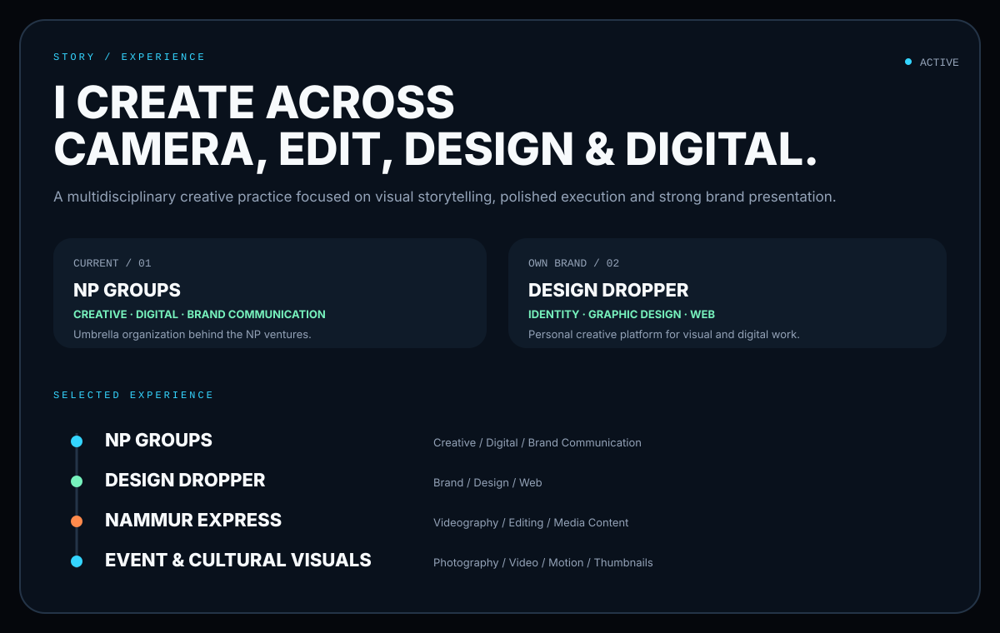
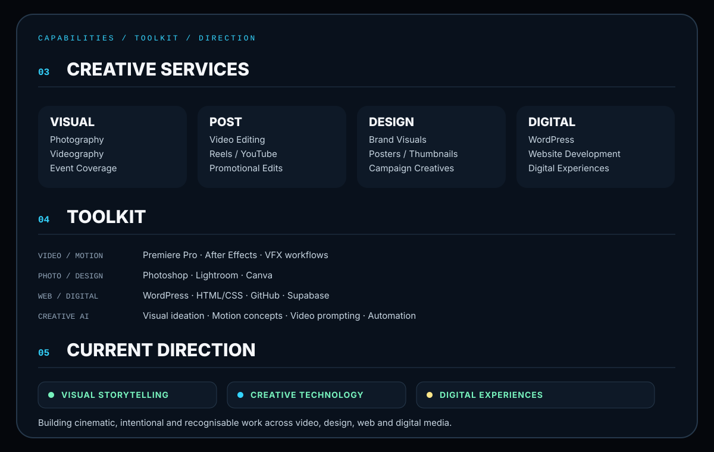
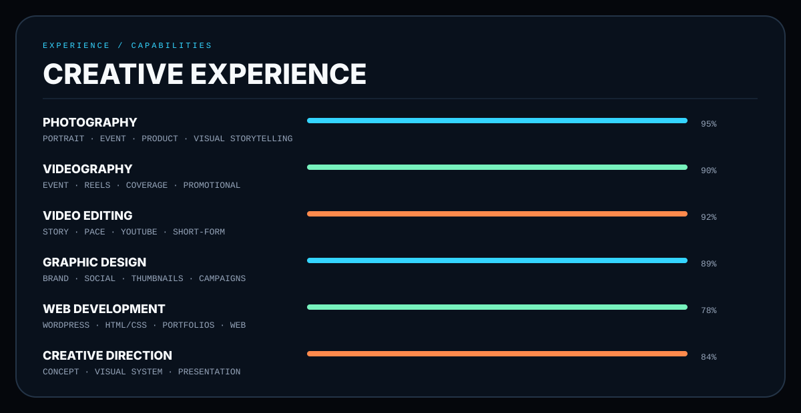
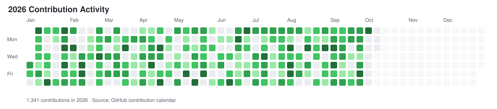
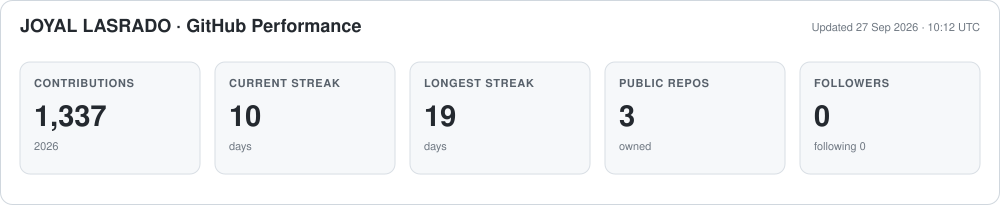

<picture>
  <source media="(prefers-color-scheme: dark)" srcset="./dark_mode_v2.svg" />
  <source media="(prefers-color-scheme: light)" srcset="./light_mode_v2.svg" />
  
</picture>

 

  

 

<picture>
  <source media="(prefers-color-scheme: dark)" srcset="./story_dark_v5.svg" />
  <source media="(prefers-color-scheme: light)" srcset="./story_light_v5.svg" />
  
</picture>

 

## CREATIVE STACK

<table>
<tr>
<td align="center" width="20%">
 
<b>Photoshop</b>
</td>
<td align="center" width="20%">
 
<b>Premiere Pro</b>
</td>
<td align="center" width="20%">
 
<b>After Effects</b>
</td>
<td align="center" width="20%">
 
<b>Lightroom</b>
</td>
<td align="center" width="20%">
 
<b>Figma</b>
</td>
</tr>

<tr>
<td align="center">
 
<b>WordPress</b>
</td>
<td align="center">
 
<b>HTML5</b>
</td>
<td align="center">
 
<b>CSS3</b>
</td>
<td align="center">
 
<b>GitHub</b>
</td>
<td align="center">
 
<b>Supabase</b>
</td>
</tr>

<tr>
<td align="center">
 
<b>Canva</b>
</td>
<td colspan="4"></td>
</tr>
</table>

 

## CAPABILITIES

<picture>
  <source media="(prefers-color-scheme: dark)" srcset="./capabilities_dark_v1.svg" />
  <source media="(prefers-color-scheme: light)" srcset="./capabilities_light_v1.svg" />
  
</picture>

 

<picture>
  <source media="(prefers-color-scheme: dark)" srcset="./experience_dark_v6.svg" />
  <source media="(prefers-color-scheme: light)" srcset="./experience_light_v6.svg" />
  
</picture>

 

## CONTRIBUTION ACTIVITY

<picture>
  
</picture>

Generated directly from GitHub contribution data and refreshed automatically every day.

 

## GITHUB PERFORMANCE

<picture>
  
</picture>

Current-year contributions, streaks, repositories and followers are generated from GitHub's own API.

 

## FEATURED PROJECTS

<table>
<tr>
<td width="50%" valign="top">

### Design Dropper
Creative design and digital solutions brand focused on visual identity, web presence, and digital experiences.

**Focus:** Branding · Web · Visual Design · Digital Experiences

[**Visit Design Dropper →**](https://designdropper.com)

</td>
<td width="50%" valign="top">

### GitHub Profile System
A custom GitHub profile experience built with responsive SVG interfaces, automated contribution metrics, GitHub Actions, and light/dark presentation.

**Stack:** SVG · Python · GitHub Actions · GraphQL · Markdown

[**Explore the Profile Repository →**](https://github.com/Monster316/Monster316)

</td>
</tr>

<tr>
<td colspan="2" valign="top">

### DesignDropper Minecraft Network
A public repository inside the Design Dropper ecosystem and part of my growing collection of public digital projects.

[**View Repository →**](https://github.com/Monster316/DesignDropper-Minecraft-Network)

</td>
</tr>
</table>

Public repositories are linked above. Client software is described at a high level without releasing proprietary code or private data.

 

## SELECTED BUSINESS SOFTWARE

*Real-world applications and workflow systems developed for business operations. Project descriptions only — production source code, customer information, and internal infrastructure remain private.*

[**EXPLORE ALL SOFTWARE CASE STUDIES →**](./case-studies/README.md)

<table>
<tr>
<td width="50%" valign="top">

### [NP Gruha Samruddhi Scheme](./case-studies/np-gruha-samruddhi-scheme.md)
Customer savings-scheme management for electronics and furniture retail.

**Modules:** Customer onboarding · 12-month installments · Receipts · Maturity benefits · Role-based access · Audit trails · Reporting

**Focus:** Business applications · PWA · Operational automation

</td>
<td width="50%" valign="top">

### [NP Chill Station POS](./case-studies/np-chill-station-pos.md)
A café billing and operations solution with kitchen order tickets and separate AC/non-AC pricing.

**Modules:** Billing · KOT · Supplier and customer balances · Attendance · Staff permissions · Receipt customization

**Focus:** Point of sale · Hospitality workflows · Business software

</td>
</tr>
<tr>
<td width="50%" valign="top">

### [NP Staff Hub](./case-studies/np-staff-hub.md)
Workforce attendance and staff coordination application designed around a biometric punch system.

**Modules:** Attendance visibility · Late-arrival reasons · Leave requests · Weekly-off approval · Team communication

**Focus:** Workforce management · Access control integration

</td>
<td width="50%" valign="top">

### Design Dropper
Creative and digital-solutions work spanning branded content, WordPress websites, editing, visual design, and bespoke software.

**Services:** Video editing · Motion graphics · Branding · WordPress · Business software

[**Explore Design Dropper →**](https://designdropper.com)

</td>
</tr>
</table>

## CURRENTLY BUILDING

<table>
<tr>
<td width="33%" align="center" valign="top">

### NP GROUPS
Creative, digital and technology work across the NP ecosystem.

**Branding · Media · Web · Digital Systems**

</td>
<td width="33%" align="center" valign="top">

### DESIGN DROPPER
Growing a personal creative-tech brand for design, websites and digital experiences.

**Design · WordPress · Frontend · Creative Direction**

</td>
<td width="33%" align="center" valign="top">

### SOFTWARE & AUTOMATION
Building practical tools for business workflows, customer management and digital operations.

**Supabase · Web Apps · Automation · GitHub**

</td>
</tr>
</table>

 

FOCUS: CREATIVE TECHNOLOGY · DIGITAL PRODUCTS · VISUAL STORYTELLING

 

## WORK WITH ME

I’m open to creative, media, web, branding and digital-product collaborations.
If you have a project that needs strong visual execution or a practical digital solution, let’s connect.

<table>
<tr>
<td align="center" width="25%">
<a href="https://github.com/Monster316"><b>GITHUB</b></a> 
Code & projects
</td>
<td align="center" width="25%">
<a href="https://designdropper.com"><b>DESIGN DROPPER</b></a> 
Creative & web work
</td>
<td align="center" width="25%">
<a href="https://www.instagram.com/joyal_j_lasrado_"><b>INSTAGRAM</b></a> 
Visual work & updates
</td>
<td align="center" width="25%">
<a href="https://www.facebook.com/share/1Eti8xAp8K/"><b>FACEBOOK</b></a> 
Connect directly
</td>
</tr>
</table>

 

**AVAILABLE FOR SELECT CREATIVE & DIGITAL COLLABORATIONS**

 

[**DESIGN DROPPER**](https://designdropper.com) &nbsp;&nbsp;·&nbsp;&nbsp;
[**INSTAGRAM**](https://www.instagram.com/joyal_j_lasrado_) &nbsp;&nbsp;·&nbsp;&nbsp;
[**FACEBOOK**](https://www.facebook.com/share/1Eti8xAp8K/)

  

**CREATE WITH INTENT. BUILD WITH PURPOSE.**

JOYAL LASRADO / MONSTER316

