<picture>
  <source media="(prefers-color-scheme: dark)" srcset="./joyal_os_dark.svg" />
  <source media="(prefers-color-scheme: light)" srcset="./joyal_os_light.svg" />
  
</picture>

<!-- JOYAL OS // CREATIVE TERMINAL -->

<picture>
  <source media="(prefers-color-scheme: dark)" srcset="dark_mode.svg" />
  <source media="(prefers-color-scheme: light)" srcset="light_mode.svg" />
  
</picture>
