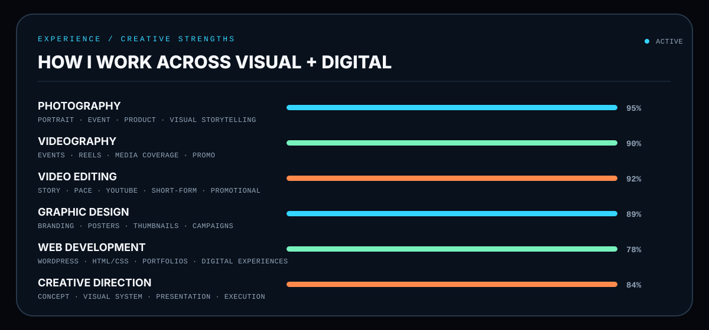

<picture>
  <source media="(prefers-color-scheme: dark)" srcset="./dark_mode_v2.svg" />
  <source media="(prefers-color-scheme: light)" srcset="./light_mode_v2.svg" />
  
</picture>

 

**PHOTOGRAPHY · VIDEOGRAPHY · VIDEO EDITING · GRAPHIC DESIGN · WEB**

 

[**DESIGN DROPPER**](https://designdropper.com) &nbsp;&nbsp;&nbsp; [**INSTAGRAM**](https://www.instagram.com/joyal_j_lasrado_) &nbsp;&nbsp;&nbsp; [**FACEBOOK**](https://www.facebook.com/share/1Eti8xAp8K/)

 

## 01 / NARRATIVE

I’m **Joyal Lasrado**, a multidisciplinary creative professional from **Karkala, Karnataka, India**. My work moves between **camera, edit, design and technology** — building visual stories, branded communication and digital experiences that feel polished and intentional.

I currently work with **NP Groups**, the umbrella organization behind the NP ventures, contributing across **creative, digital and brand communication**. Alongside that, I continue developing my own creative identity through **Design Dropper** and bring previous media-production experience from **Nammur Express**.

> My goal is simple: turn ideas into visual work that feels clear, cinematic and memorable.

 

## 02 / EXPERIENCE STORY

<table>
<tr>
<td width="33%" valign="top">

### NP Groups
**Creative · Digital · Brand Communication**

Creative and digital work across the NP ventures under the NP Groups umbrella.

</td>
<td width="33%" valign="top">

### Design Dropper
**Design · Identity · Web**

My personal creative platform for branding, visual communication and digital presentation.

</td>
<td width="33%" valign="top">

### Nammur Express
**Video · Editing · Media**

Videography, event coverage, editing and social-media content for digital publishing.

</td>
</tr>
</table>

 

## 03 / SOFTWARE STACK

  

 

## 04 / EXPERIENCE BARS

<picture>
  <source media="(prefers-color-scheme: dark)" srcset="./experience_dark_v3.svg" />
  <source media="(prefers-color-scheme: light)" srcset="./experience_light_v3.svg" />
  
</picture>

 

## 05 / CREATIVE SERVICES

**Visual Production**  
Photography · Videography · Event Coverage · Product Visuals · Social Media Content

**Post Production**  
Video Editing · Reels · YouTube Videos · Promotional Edits · Motion-led Content

**Design**  
Brand Visuals · Posters · Thumbnails · Banners · Social Creatives · Promotional Campaigns

**Digital**  
WordPress · Website Development · Portfolio Sites · Digital Presentation · Creative Web Experiences

 

## 06 / CURRENT DIRECTION

I’m currently focused on work that feels **more cinematic, more intentional and more recognisable** — combining:

**visual storytelling + brand presentation + polished editing + digital experiences**

 

**CREATE WITH INTENT. BUILD WITH PURPOSE.**

JOYAL LASRADO / MONSTER316

